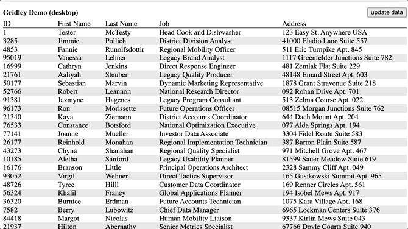

# Gridley

A simple data grid component that responsively adjusts layout based on screen widths.  Uses a CSS grid layout with repeating rows.  Does not fetch, sort, paginate or anything other than layout data in a grid.  Those things can be built on top of Gridley if desired but are not built-in.

Most tabular grids are "responsive" by switching grid from a table to a "**label:** _value_" layout on mobile screens, or by just allowing rows to wrap when content doesn't fit.

Gridley goes far beyond those techniques.  It can accommodate any number of breakpoints and change column orders, alignment, and even row spanning for each size.  Cell rendering is specified globally on the grid and then multiple layout's specify how each cell is rendered.  Appropriate ARIA attributes (table, rowheader, row, columnheader, cell) are applied to the elements.

Image a grid that has every row on a single line this on desktop.  And on tablet, each row takes two lines, and ID appears at the end vertically centered between them.  Then on mobile it uses three lines per row, the job & address switch places while spanning the entire width.

Rendering and layouts are specified in JSX without duplication.  Each cell is rendered the same regardless of layout.

For an usable example of the screenshots above, try [the sandbox example](https://codesandbox.io/s/ihjq23?module=/example.tsx) as well as the source in [demo/demo.tsx](demo/demo.tsx)

## Gridley Components

#### Gridley

 * **data** an array of either arrays or objects
 * **defaultLayout** the id of the layout to use if none of the specified sizes match
 * **forceLayout** Force the grid to display using the specified layout id.  Useful for printing or any case where you want to force a certain display.
 * **caption** content to insert at the top of the grid.
 * **rowAttributes** function | HTMLAttributes
  A list of attributes to be added to each row as its rendered.  If a function is specified, it will be passed the row and current layout and should return HTMLAttributes 

#### Columns

 * No props, but must have one or more **Column** as children.  Each Column listed as a child _may_ also appear as a child of one or more **Layout** children

#### Layout
 * **id** string _(required)_  Identifier for the layout._
 * **stripe** boolean | string defaults to true.  When set, will set the background color of every other row.  If `true`, color will be a light grey.
 * **min** number | string _(required)_ The minimum width of the layout. If a number, refers to pixels, if string can be any valid css dimension such as rem or vw.
 * **max** number | string _(required)_ The maximum width of the layout. If a number, refers to pixels, if string can be any valid css dimension such as rem or vw.
 * **cellPadding** number | string | boolean _(optional, defaults to 5px)_ Applies the given amount of padding to cells in the grid.  Can be disabled by setting to `false`
 * **style** CSSObject _(optional)_ specific styles to apply to the grid when layout is active.  Useful for setting header border or any other specific styles.  For examples see the [demo source](demo/demo.tsx)
 * **children**  Each child of a layout must be a **Column** that is also included inside of the **Columns** element.

#### Column

When used as a child of **Columns** it documents how data is rendered.  The parent element inside `header` and `body` may be a `Cell`, or any custom element.  If a custom element is used, it will be passed a string `id` prop.  That id must be rendered the the DOM as `data-cell-id` in order for elements to be positioned properly.

 * **id** a unique identifier for each column
 * **dataPath** the path to the value for each column.  Uses [lodash get](https://lodash.com/docs/4.17.15#get) internally.  If not provided, the column id is used.
 * **header** React.ReactElement - element to be rendered for the column in the header.
 * **body** React.ReactElement - element to be rendered for the column for each row in the body.
 

When placed inside a **Layout**, it documents how the column is placed in the grid.  Columns will appear in the order they are placed under the Layout.

 * **id** a unique identifier for each column, must match the id given for the Column in the Columns section.
 * **min** number | string _(optional)_ The minimum width of the column. Pixel value when a number, when string can be any valid css dimension such as rem or vw.
 * **max** number | string _(optional)_ The minimum width of the column. Pixel value when a number, when string can be any valid css dimension such as rem or vw.
 * **colSpan** number _(optional, defaults to 1)_ How many columns to span
 * **rolSpan** number _(optional, defaults to 1)_ How many rows to span
 * **wrap** number | boolean _(optional)_ If the cell is wrapped onto a new line, and if so how many pixels tall the rows are.  When using a sticky header, wrapped columns need to know their row height to position them correctly.
 * **justify** any valid css justify-content value.  Controls the alignment of items inside the column.
 * **width** number | string _(optional)_ A fixed with for the column

## Gridley Hooks

#### useCurrentLayout()

Returns the current `Layout` the grid is using.  For an example see the Caption component in the [demo source](demo/demo.tsx)

#### useIsLayoutActive(layoutId: string):boolean

True if the grid is using the layout.  Really just a convenience, it calls `useCurrentLayout().id` internally.

### Misc

There is also `useGridContextState` and `useGridContextDispatch` hooks but they're considered internal and may change their behavior.  Please notify me if you find them useful and I can document
